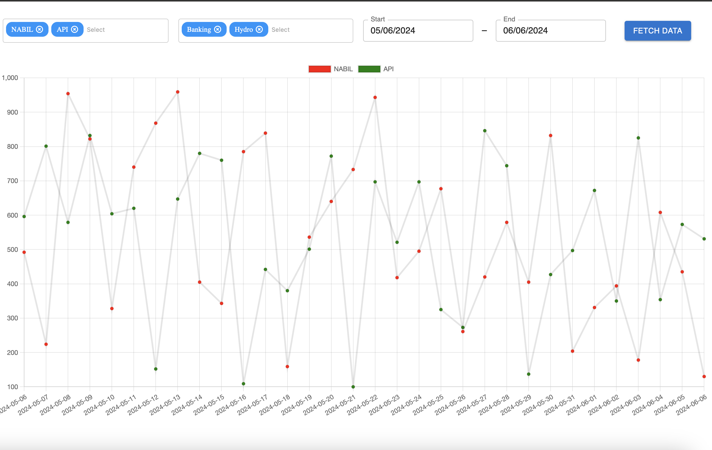

# Nepse Visualization Chart

An analytics project to scrape and summarize visualize data daily transactions that happens through brokers in Nepal Stock Exchange.

### Dependencies
- [Background Data Collection](https://github.com/robinnarsinghranabhat/sharesansar_datascrape) : This Repo Scrapes Official Nepal Stock Exchange Website Daily for daily Transactions through brokers in Nepse.
- [NEPSE BACKEND APIS](https://github.com/robinnarsinghranabhat/nepse-analytics-backend/) : This repo has backend APIS to get aggregated results

### Goal 
NEPSE is often regarded as prone to manipulation by a small group of players injecting large amounts of capital to artificially raise or drop prices. Since all transactions flow through brokers, this project aims to `develop visualizations` that show whether specific brokers—potentially linked to high-profile manipulators—are continuously accumulating or selling stocks over several days to create artificial spikes or drops in prices. 
Well, assumption is, these `players` don't switch brokers to buy/sell stocks.

-   

This project was bootstrapped with [Create React App](https://github.com/facebook/create-react-app).
